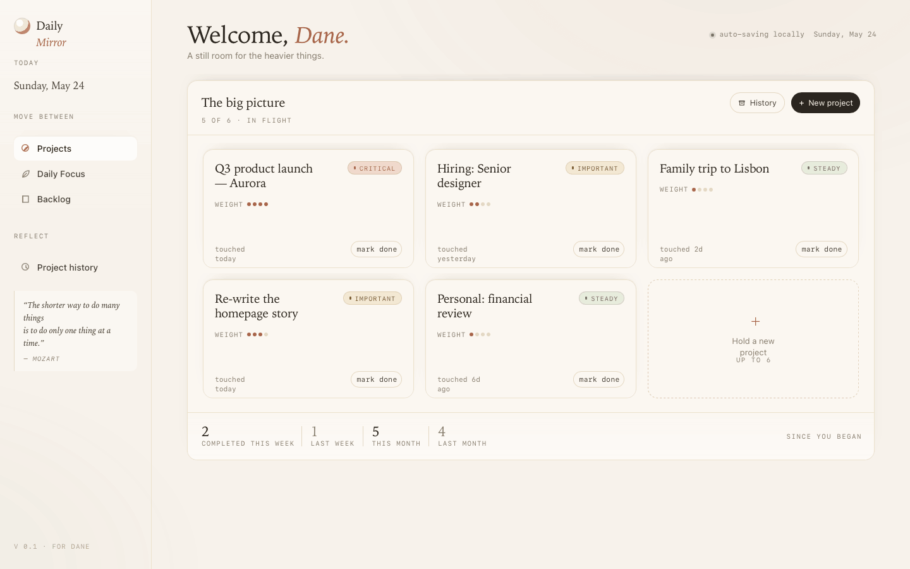
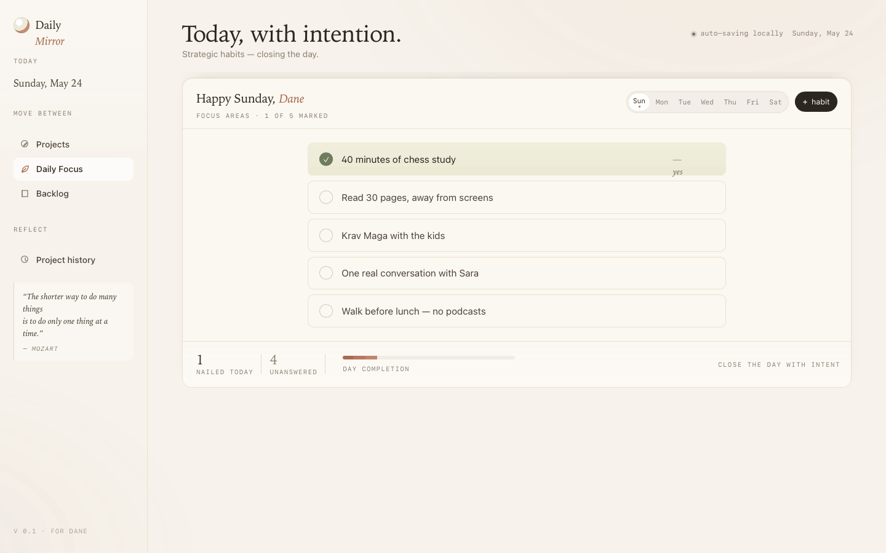
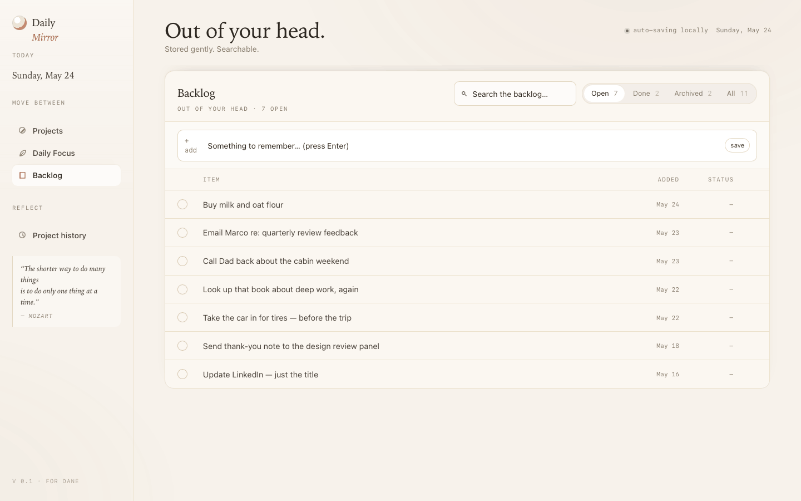

# Daily Mirror

A personal desktop companion for working with intention. Three views, nothing more.



---

## What it is

Daily Mirror is a macOS app built around a single idea: calm, directed effort on the things that matter.

It doesn't try to be a full task manager. It holds the heavy things so your mind doesn't have to.

**Projects** — the five or six things that are genuinely consuming you right now. Track weight, priority, and completion. A quiet history of everything you've put down.

**Daily Focus** — a fixed set of strategic habits, tracked per day. Chess, exercise, family time — the recurring things that make the rest possible. Mark what you nailed. Close the day with intent.

**Backlog** — everything else, out of your head. Add it fast, filter it, mark it done or archive it. A bullet journal in app form.

---

## Install

Download `daily-mirror_*_aarch64.dmg` from the [latest release](../../releases/latest), open it, drag **Daily Mirror** to Applications.

**First launch note:** the app is unsigned. macOS will block it. Run this once in Terminal:

```bash
xattr -dr com.apple.quarantine "/Applications/daily-mirror.app"
```

Then open normally.

---

## Views

| | |
|---|---|
|  |  |
| Projects | Daily Focus |
|  | |
| Backlog | |

---

## Stack

- [Tauri v2](https://tauri.app) · [React 19](https://react.dev) · [Vite](https://vite.dev) · TypeScript
- All data stored locally in `localStorage` — no accounts, no sync, no cloud
- macOS only (Apple Silicon)

---

*Built for one person. Kept simple on purpose.*
